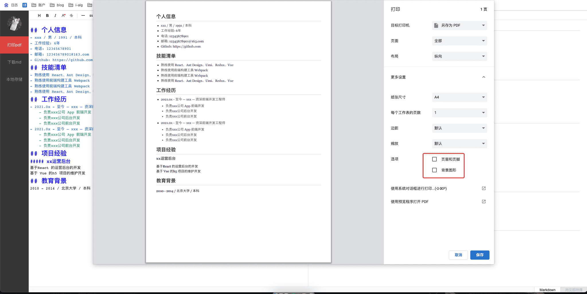
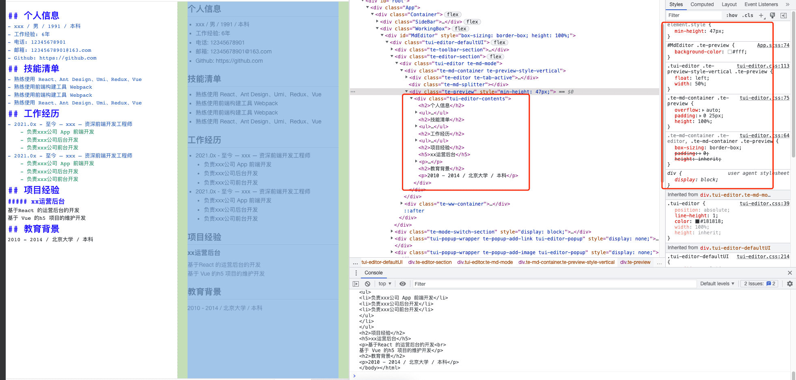

# md2pdf resume

> 😄 纯前端根据 Markdown 生成 PDF 简历

- 项目借鉴自 [冷熊简历](http://cv.ftqq.com/#)，但不依赖服务器生成 pdf，方便用户调整 css 样式
- 地址：https://hugeorange.github.io/md2pdf-resume
- 支持打印成 pdf（注意打印设置里面去掉页眉页脚）
- 支持本地存储到 localStorage
- 项目截图 
- 使用者可以随时在开发者工具提里调整 css 样式然后直接保存 pdf 
